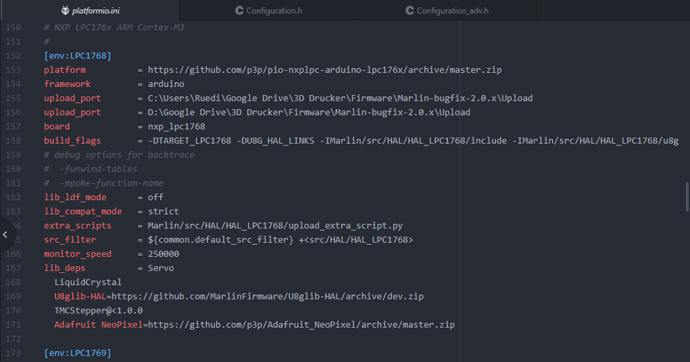

# 32bit_FWupdate_for_Octoprint
Bashscript for Firmware Update on 32Bit Boards (Marlin)

At first, it is not Plug & Play and it is more "Quick and Dirty" than "Nice and Clean". But it is my way I managed a "One click Firmware Update" for my SKR V1.3 Board, and it works. Yay!

## Baseline:

- I have my Marlin Firmware Files on Google Drive, so i can access it from different pc's.
- My 3D Printer is connected to my WiFi over a RPi 3B+ with Octoprint running on it.
- I use PlatformIO to compile the 32bit Marlin Firmware

## My Goal was:

- making firmwarechanges
- hit PIO Upload
- press one Button in Octoprint
- Done!

## Setup:

Here I descibe my Setup, i don't know if it works with other Setups.
It is possible to work without Google Drive and send the firmware.bin from the local Machine, but more on this later in the Setup. 

### 1. PlatformIO

#### Platformio.ini
In the enviroment Section of your Processor, in my case [env:LPC1768], it is possible to define additional Upload Ports.
By default, the compiled File is stored in the Folder ...\ .pioenvs\LPC1768\firmware.bin if you hit Compile.
If you click PIO Upload, PlatformIO stores the File in the folder and tries to Upload to the Board if it is connected via USB. If no Board is present, the file will be uploaded to the additionaly defined Upload Ports. In My case, i defined  one Port for each of my PC's

